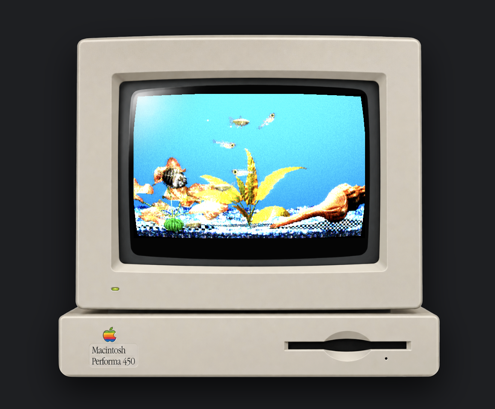
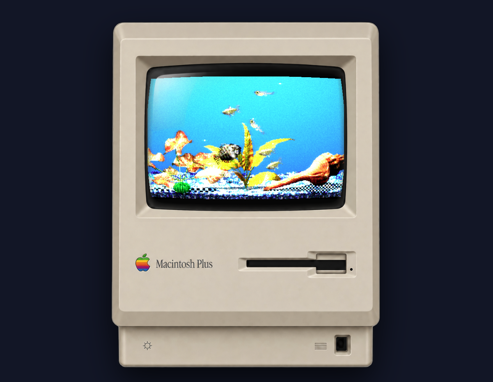

# Finsical

**Latest release:** v<!-- version -->0.4.0<!-- /version --> · [Download](https://github.com/L-K-M/Finsical/releases/latest) · [Changelog](CHANGELOG.md)



> [!IMPORTANT]
> LLM disclosure: This codebase was written with substantial help from large language models: AI coding agents working from the [`AGENTS.md`](AGENTS.md) brief in this repo.

A lightweight retro virtual aquarium for modern macOS: little pixel fish in a
floating window, in the spirit of the 90s Mac classic **[AquaZone](https://www.youtube.com/watch?v=I05H8mLGd-s)**.

Ships no copyrighted assets: the app imports the original game data you supply
(or downloads from public archives) and converts it into a runtime bundle.



Archive.org integration inspired by [Afterglow](https://morphing.cloud/afterglow/).

## Download and first launch

**Requirements:** macOS 12 or later on an Apple silicon Mac. The release
build contains only an arm64 binary; on an Intel Mac, [build from
source](#build-from-source), which compiles for the Mac that runs the build.

1. Download `Finsical-<version>-macOS.zip` from the
   [latest release](https://github.com/L-K-M/Finsical/releases/latest)
   (`SHA256SUMS.txt` next to it lets you check the download).
2. Unzip it and move `Finsical.app` to `/Applications`.
3. Open it. Finsical is ad-hoc signed and not notarized by Apple, so
   macOS blocks the first launch:
   - **macOS 15 and later:** after the warning, choose **Done**, open
     **System Settings > Privacy & Security**, scroll to **Security**,
     click **Open Anyway** next to the Finsical message, and confirm.
     Control-click > Open no longer bypasses Gatekeeper on macOS 15.
   - **macOS 12 to 14:** Control-click the app, choose **Open**, then
     **Open** again in the dialog.

   Alternatively, remove the quarantine flag in Terminal. This skips
   Gatekeeper's check for this one app, so only do it for software you
   trust:

   ```sh
   xattr -dr com.apple.quarantine /Applications/Finsical.app
   ```

macOS remembers your choice; later launches open normally.

A new tank starts with four stand-in fish, and Finsical offers to
stock it with a starter set of Aquazone fish, a gravel, a plant, a
background and the game's sound effects from the Internet Archive
(about 2 MB). Choose **Not Now**
to keep the stand-ins; you can add the same things later from Import
Add-ons. If you close Finsical before answering, it asks again next
time. If stocking the tank doesn't finish, later launches offer the
rest until it arrives or you choose **Not Now** or **Stop**.

## Using Finsical

| Action | How |
| --- | --- |
| Feed the fish | Click above the waterline, in the dark strip at the top of the tank (the pointer becomes a crosshair) |
| Tap the glass | Click in the water; nearby fish startle |
| See a fish's name | Point at it: a balloon names it and says what it is doing |
| Get Info on a fish | Option-click it: a card follows it with its health, hunger and mood |
| Move the window | In the app, drag the computer case around the tank, or the top edge of the window |

A fish nearby comes over to look at the pointer while you hover over
the tank, unless it is hungry or startled. At night the pointer also
works as a torch, lighting a warm circle of the dark tank.

### Keeping the tank

The tank lives like the original AquaZone's, in real time: a fed fish
gets hungry again after most of a day, and time passes while Finsical
is closed (see [docs/ORIGINAL-SIM.md](docs/ORIGINAL-SIM.md) for the
rules). Tank Stats shows the water on its Water tab, as mg per litre,
and has the controls to keep it on its Keeping tab:

- **Heater:** holds the water at the temperature you set.
- **Filter:** aerates the water and, once it has some dirt in it,
  breaks ammonia down into nitrate. Clean it a little at a time: a
  spotless filter breaks nothing down.
- **Water change:** replaces part of the water with tap water at the
  temperature you pick. Tap water carries chlorine, so add Chlorine
  Remover or let it gas off, and match the temperature, or the fish
  get a shock.
- **Medicine:** Green Remedy and Methylene Blue cure the common fish
  diseases; the water treatments soften the water, raise or lower the
  pH, and remove chlorine. A dose dissolves over a few hours.
- **Time:** real time, or up to 100 times faster.

Fish fall sick when poor water, hunger or shocks wear their health
down, and a sick fish can pass its disease to the weakest fish in the
tank. A fish that dies floats belly-up and then sinks; remove it from
Tank Overview before it fouls the water.

Menu commands in the app:

| Command | Menu | Keys |
| --- | --- | --- |
| About Finsical | Finsical | |
| Preferences… | Finsical | Cmd-, |
| Hide Finsical, Hide Others | Finsical | Cmd-H, Option-Cmd-H |
| Quit Finsical | Finsical | Cmd-Q |
| Tank Overview | Tank | Cmd-O |
| Tank Stats | Tank | Shift-Cmd-S |
| Import Add-ons… | Tank | Cmd-I |
| Feed Fish | Tank | Cmd-F |
| Change Water (the last change set in Tank Stats) | Tank | |
| CRT Effect (checked while on) | Tank | Cmd-R |
| Lamp On (checked while on) | Tank | Cmd-L |
| Mute Sound (checked while muted) | Tank | Option-Cmd-S |
| Pause Simulation, Resume Simulation | Tank | Cmd-P |
| Support the Internet Archive | Tank | (opens archive.org/donate in your browser) |
| Close, Minimize | Window | Cmd-W, Cmd-M |
| Float Above Other Windows, Show on All Desktops | Window | (on by default, remembered) |
| Finsical Help | Help | Cmd-? (opens this README) |

Cmd-W closes Preferences and the other windows but not the tank; quit
with Cmd-Q.

Keys on the tank page, in the app and the browser build (see
[Build from source](#build-from-source)):

| Key | Action |
| --- | --- |
| F | Feed the fish |
| L | Switch the lamp off or on |
| M | Mute or unmute the sound |
| P | Pause or resume the tank |
| C | Toggle the CRT effect |
| S | Open Tank Stats in a window of its own (browser only) |
| Ctrl-I or Cmd-I | Open the add-on browser over the tank (browser only; the app's Cmd-I opens the Import Add-ons window) |
| Esc | Close the Get Info card or the front window |

In a browser, the tank page has a Mac OS 8 menu bar of its own, with
the same commands plus **Take a Picture**, which saves the tank as a
PNG. On touch screens without a keyboard, an **Add-ons…** button opens
the add-on browser.

## Add-ons

**Import Add-ons** lists add-ons hosted on the Internet Archive. Pick a
section from the **Show** pop-up, type in **Filter** to narrow the list,
select an add-on to preview it, and click **Add to Tank**. A tank holds
up to 24 fish. The sections are:

| Section | Contents |
| --- | --- |
| Fish | Add-on and modded fish, plus the Japanese release's fish and its non-retail bonus fish |
| Gravel | Gravel packs from both archive.org items |
| Plants, Accessories | Meka Asia packs and the Japanese release's item library |
| Backgrounds, Tanks | The Japanese release's backdrops and tank sets |
| Sounds | The game's own sound effects (AZ_WAVES), and audio from the Japanese set's non-retail bonus bundle, such as its CD bonus track |

You can also drag files from the Finder onto the tank:

| What you drop | What happens |
| --- | --- |
| An `.azpack` folder (made by the [asset tools](#asset-tools)) | Its fish, art and sounds are imported |
| Aquazone pack files: fish (`.fsh`), gravel (`.grv`), plants (`.plt`), accessories (`.acc`), tanks (`.azn`), or the base library (`.REZ`, fish and scenery) | Imported into their section and kept, so they come back at every launch |
| Your own picture: a 256-color BMP (`.bmp`) of at least 160 by 100 pixels | Becomes the backdrop and is kept, like a pack file. A strip at least three times as wide as it is tall becomes the gravel instead. Other pictures, such as 24-bit BMPs, get an alert |
| Resource files with `snd ` resources: `.rsrc`, MacBinary `.bin`, BinHex `.hqx`, AppleDouble, and the Windows game's sound bank `AZ_WAVES.REZ` | Their sounds are imported and kept |
| Audio files: `.wav`, `.mp3`, `.aif`, `.aiff`, `.m4a`, `.ogg`, `.flac` | Imported as sounds and kept |

Sound files over 32 MB are skipped. The Import Add-ons window accepts the
sound formats too.

Installed archive.org add-ons come back at every launch. Remove fish and
add-ons in Tank Overview, choose which installed gravel or background
is on display with **Use**, or start over with **Empty Tank…**.

## Sounds

With the game's sound effects installed, the tank plays them when
AquaZone did:

| When | Sound |
| --- | --- |
| Always, under everything else | The filter's bubbling, on a loop (**Water ambience** in Preferences) |
| The tank opens | The water sound, once per session. In a browser it waits for your first click. |
| You feed the fish | Food dropping in |
| You tap the glass | A knock that depends on where you tap: the middle, a side, the top or the bottom |
| A fish goes in | A small splash |
| A backdrop, gravel, plant or accessory goes in | A bigger splash |
| You remove a fish | Water running out |
| Change Water | The water change |
| The lamp goes on or off | The light switch |

The game has no sound for a single rising bubble. **Bubble sounds**
plays one only if you add a short sound with "bubble" in its name.
The rest of the set, for breeding, sickness, medicine, the filter,
timers and the game's dialogs, has no matching feature in Finsical
yet.

## Windows

| Window | What it does |
| --- | --- |
| Preferences | **Machine**: the computer case around the tank (Macintosh Plus, Performa 450 and 5200, 20th Anniversary Mac, iMac G3 and G4, PowerBook G3, iBook, or a bare tank). **Monitor**: the CRT effect, presets and its picture tube sliders. **Picture**: the monitor's front-panel controls. **Lighting**: the day and night cycle, a light timer that follows your Mac's clock, or lights always on, and the lamp. **Sound**: volume, mute, and switches for bubble sounds and the water ambience (see [Sounds](#sounds)). |
| Tank Overview | Everything in the tank as a sortable Name, Kind and Status list, with **Remove**, **Use** for scenery and **Empty Tank…** |
| Import Add-ons | The archive.org add-on browser described above |
| Tank Stats | **General**: water quality and average hunger with recent history, the hungriest fish, fish and food counts, day or night, tank age and care hints. **Water**: the water's readings per litre. **Keeping**: the heater, filter, water changes, medicine and how fast time runs. **Copy Summary** puts the readings on the clipboard. |

## Your data

Everything stays on your Mac:

- **localStorage**, under `finsical:*` keys: the tank itself
  (`finsical:tank`: fish, water quality, installed add-ons and the
  scenery on display, saved every 10 seconds and when the page closes or
  hides), the CRT switch and settings (`finsical:crt`,
  `finsical:crt-cfg`), the machine case (`finsical:machine`), lighting
  and sound settings (`finsical:lighting`, `finsical:sound`), whether
  the tank is paused (`finsical:paused`), the last water change
  (`finsical:waterChange`), which tab owns the sim
  (`finsical:tank-owner`), the Auto Feed, tap-the-glass sign and
  startup-parade switches (`finsical:autofeed`, `finsical:scoldSign`,
  `finsical:boot`), how far the first-run offer got and
  whether its sound effects were handled (`finsical:welcomed`,
  `finsical:starterSounds`), and the last Preferences pane and
  add-on section (`finsical:prefsPane`, `finsical:addonSection`).
- **IndexedDB** database `finsical`: downloaded add-on archives,
  thumbnails and archive.org listing pages, so installed add-ons restore
  offline. Cached downloads are evicted least recently used once they pass
  about 150 MB. Sounds you import and packs and pictures you drop onto
  the tank are stored there too and are never evicted; removing a
  dropped pack or picture in Tank Overview deletes it.
- **macOS defaults** (`dev.finsical.app`): window positions.

The only network host Finsical contacts is archive.org, for add-on listings
and downloads. Other web links open in your default browser.

## Build from source

You need Node.js 22 or later and Python 3.9 or later (stdlib only). The
macOS app also needs the Xcode Command Line Tools (`xcode-select --install`);
there is no Xcode project.

```sh
npm ci
npm run typecheck
npm test
python3 -m unittest discover -s tools/tests -p 'test_*.py' -t .
```

**Browser build:** `npm run dev` rebuilds the pages on every change and
serves `web/` at <http://localhost:8080/>. The tank is `index.html`; open
the other windows (`prefs.html`, `overview.html`, `addons.html`,
`stats.html`) as tabs in the same browser, where they reach the tank over
`BroadcastChannel`. Put an emitted `.azpack` (`manifest.json` at its root)
in `web/pack/` to load it at startup; the app build bundles it too.

**macOS app:** `scripts/build.sh` runs all the checks above, then builds
`macos/Finsical.app`. Options:

| Option | Effect |
| --- | --- |
| `--clean` | Delete the previous app build and `dist/` first |
| `--install` | Copy the app to `/Applications` and reveal it in the Finder |
| `--run` | Open the built app |

On other platforms, `scripts/build.sh` runs the checks and stops before
packaging.

## Asset tools

`tools/fetch.py` downloads AquaZone archives from archive.org (by default
the [`aquazonewithguppiesandaddons`](https://archive.org/details/aquazonewithguppiesandaddons)
item, or pass another identifier) and converts every pack and sound resource
inside into `.azpack` bundles in `packs/`. `tools/azpack.py` converts local
`.fsh`, `.acc`, `.plt`, `.azn` or `.REZ` files:
`python3 tools/azpack.py NeonTetra.fsh -o NeonTetra.azpack`. Drag the output
folder onto the tank, or put it in `web/pack/`. Both need Python 3.9 or later
and nothing beyond the standard library; run either with `--help` for
options.

## Credits and trademarks

- **AquaZone** is by 9003 Inc. (OPENBOOK 9003) and was published by
  Mindscape. Finsical ships none of its data.
- Add-ons are hosted by the [Internet Archive](https://archive.org/), from
  [AquaZone with Guppies and Add-ons](https://archive.org/details/aquazonewithguppiesandaddons)
  and the [AquaZone (JPN) Set](https://archive.org/details/aquazone-jpn-set).
- The computer case pictures are user-supplied renders of Apple hardware,
  cropped for the app (see `web/machines.ts`).
- Apple, Macintosh and iMac are trademarks of Apple Inc. Finsical is not
  affiliated with Apple, 9003 or Mindscape.
- The Mac OS 8 look comes from [Osmium UI](https://github.com/L-K-M/osmium-ui).
- The [Unlicense](LICENSE) covers Finsical's own code only. It does not
  cover AquaZone data, add-ons, or the case art. Ported third-party code
  carries its own notices.
- The one exception in the code is the MACE sound decoder
  (`core/data/mace.ts`, `tools/az/mace.py` and its tables), ported from
  FFmpeg and licensed under the LGPL 2.1 or later; see
  [THIRD_PARTY_NOTICES.md](THIRD_PARTY_NOTICES.md).
