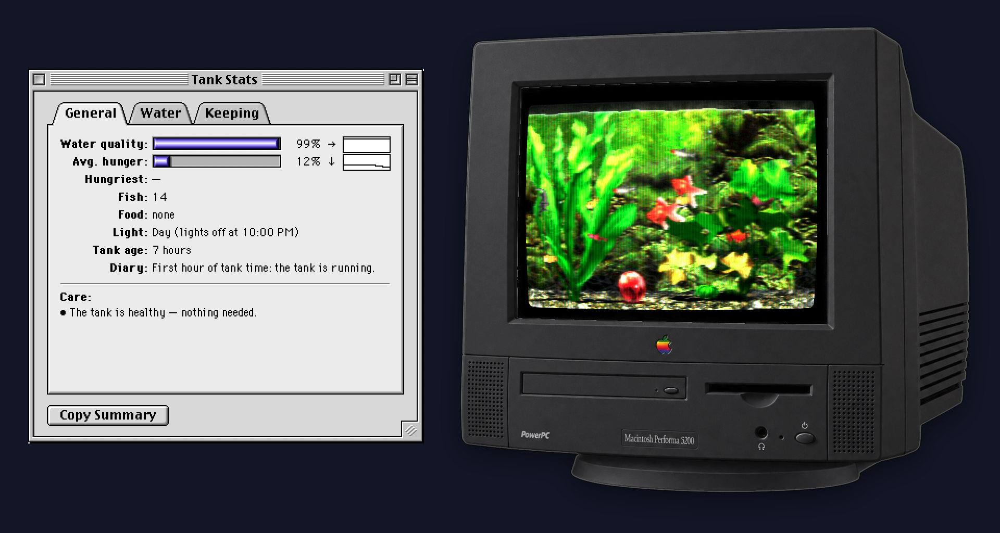
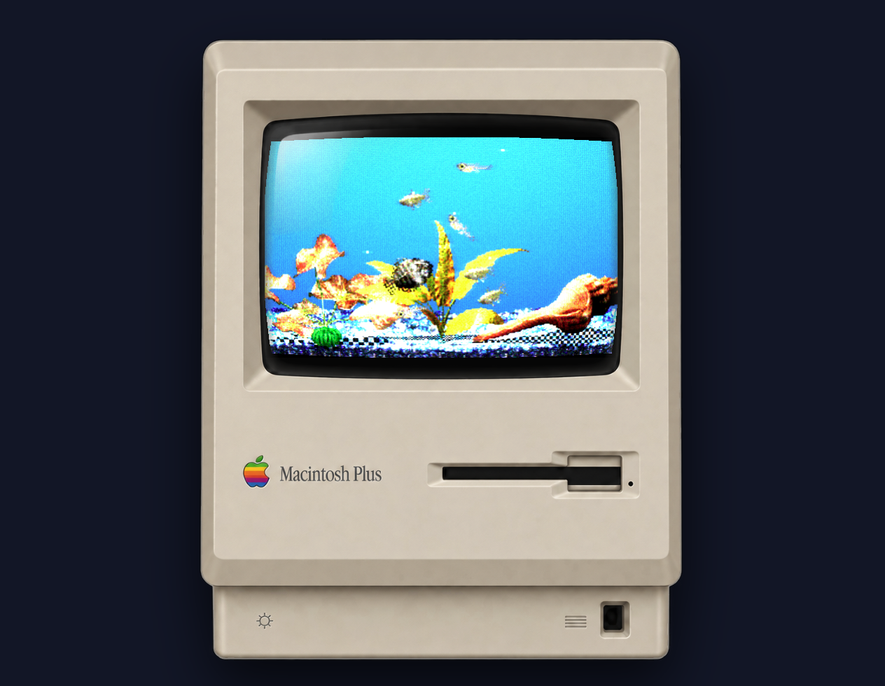

# Finsical

**Latest release:** v<!-- version -->0.8.0<!-- /version --> · [Download](https://github.com/L-K-M/Finsical/releases/latest) · [Changelog](CHANGELOG.md)



> [!IMPORTANT]
> LLM disclosure: This codebase was written with substantial help from large language models: AI coding agents working from the [`AGENTS.md`](AGENTS.md) brief in this repo.

A lightweight retro virtual aquarium for macOS, Linux and Android: little
pixel fish in a floating window, in the spirit of the 90s Mac classic **[AquaZone](https://www.youtube.com/watch?v=I05H8mLGd-s)**.

Ships no copyrighted assets: the app imports the original game data you supply
(or downloads from public archives) and converts it into a runtime bundle.



Archive.org integration inspired by [Afterglow](https://morphing.cloud/afterglow/).

## Download and first launch

Each [release](https://github.com/L-K-M/Finsical/releases/latest) has a
macOS app, a Linux package (.deb and a portable tarball) and an
Android app, with `SHA256SUMS.txt` next to them so you can check a
download.

### macOS

**Requirements:** macOS 12 or later on an Apple silicon Mac. The release
build contains only an arm64 binary; on an Intel Mac, [build from
source](#build-from-source), which compiles for the Mac that runs the build.

1. Download `Finsical-<version>-macOS.zip` from the
   [latest release](https://github.com/L-K-M/Finsical/releases/latest).
2. Unzip it and move `Finsical.app` to `/Applications`.
3. Open it. Finsical is ad-hoc signed and not notarized by Apple, so
   macOS blocks the first launch:
   - **macOS 15 and later:** after the warning, choose **Done**, open
     **System Settings > Privacy & Security**, scroll to **Security**,
     click **Open Anyway** next to the Finsical message, and confirm.
     Control-click > Open no longer bypasses Gatekeeper on macOS 15.
   - **macOS 12 to 14:** Control-click the app, choose **Open**, then
     **Open** again in the dialog.

   Alternatively, remove the quarantine flag in Terminal. This skips
   Gatekeeper's check for this one app, so only do it for software you
   trust:

   ```sh
   xattr -dr com.apple.quarantine /Applications/Finsical.app
   ```

macOS remembers your choice; later launches open normally.

### Linux

Finsical for Linux comes in three downloads. They are the same app;
pick the one that suits your system:

| Download | Use it on | Install with |
| --- | --- | --- |
| `Finsical-<version>-linux.flatpak` | Any distribution with Flatpak: Fedora, openSUSE, Arch, and Debian or Ubuntu releases too old for the .deb | Discover, GNOME Software, or `flatpak install` |
| `Finsical-<version>-linux.deb` | Debian 13, Ubuntu 24.04 or later, and distributions based on them (Linux Mint 22, KDE neon, Pop!_OS 24.04) | apt |
| `Finsical-<version>-linux.tar.gz` | Other distributions, without Flatpak, if you install GTK and WebKitGTK yourself | unpacking it |

**Which one?**

- **The Flatpak** runs on almost any distribution and brings its own
  GTK and WebKitGTK, so it is the one to use unless you are on Debian
  or Ubuntu. It runs sandboxed. Unless another Flatpak app already
  uses it, its first install also downloads the GNOME runtime from
  Flathub, about 1 GB once installed, which later Flatpak apps share. On a Wayland desktop it is a native Wayland window, so Float
  Above Other Windows and Show on All Desktops are unavailable and the
  desktop decides where the tank opens.
- **The .deb** is the smaller download on Debian and Ubuntu, and uses
  the system's GTK and WebKitGTK, which your system updates keep
  patched. On a Wayland desktop it runs through XWayland, so the tank
  can float above other windows, show on every desktop and reopen where
  you left it.
- **The tarball** is for distributions with neither dpkg nor Flatpak,
  or for running Finsical without installing anything system-wide.

A KDE or GNOME store can't open the .deb on a distribution that isn't
Debian-based (it stays on "Loading…" in Discover on Fedora): use the
Flatpak there.

The Flatpak and the .deb keep separate tanks (see [Your data](#your-data)),
so switching from one to the other starts a new tank.

#### Flatpak

1. Download `Finsical-<version>-linux.flatpak` from the
   [latest release](https://github.com/L-K-M/Finsical/releases/latest).
2. Open it with Discover or GNOME Software and choose **Install**, or
   install it from a terminal:

   ```sh
   flatpak install --user Finsical-<version>-linux.flatpak
   ```

3. Open Finsical from your desktop's applications, or run
   `flatpak run dev.finsical.app`.

To get Float Above Other Windows and Show on All Desktops on a Wayland
desktop, let the Flatpak use XWayland as the .deb does:
`flatpak override --user --socket=x11 dev.finsical.app`.

#### Debian and Ubuntu

**Requirements:** Debian 13, Ubuntu 24.04 or later: the package needs
GTK 4.12 or later, WebKitGTK 2.40 or later (`gir1.2-webkit-6.0`) and
Python 3.10 or later. On older releases, use the Flatpak.

1. Download `Finsical-<version>-linux.deb` from the
   [latest release](https://github.com/L-K-M/Finsical/releases/latest).
2. Install it with apt, which also installs GTK and WebKitGTK:

   ```sh
   sudo apt install ./Finsical-<version>-linux.deb
   ```

3. Open Finsical from your desktop's applications, or run `finsical`.

The package includes an AppArmor profile (`/etc/apparmor.d/finsical`)
that only lets Finsical create the user namespaces WebKitGTK's sandbox
needs, as Ubuntu's own profiles do for Epiphany and Geary; it restricts
nothing. Importing AIFF and M4A sounds needs `gstreamer1.0-plugins-bad`, which
apt installs with Finsical unless you turned off recommended packages.

#### Tarball

`Finsical-<version>-linux.tar.gz` is the same app as a prefix-shaped
tree: unpack and run `bin/finsical`, or merge it into `~/.local` or
`/usr/local` with `tar -xzf … --strip-components=1 -C <prefix>` to
register the desktop entry, icon and man page. You need GTK 4.12,
WebKitGTK 2.40 with its 6.0 API, and PyGObject installed; its
`README.txt` lists the package names for Debian, Fedora and Arch. On
Ubuntu 23.10 and later, AppArmor keeps WebKitGTK's sandbox from
starting for a program without a profile, so Finsical from the tarball
stops with a message there: use the .deb or the Flatpak instead.

#### X11 and Wayland

The .deb and the tarball prefer X11, and on a Wayland desktop run
through XWayland, because only there can Finsical keep the tank above
other windows, on every desktop, and where you left it. To run them as
a native Wayland window without those, start Finsical with
`GDK_BACKEND=wayland finsical`. The Flatpak uses X11 only on a desktop
without Wayland (see above to change that). Without a compositor, the
edges of the computer case are cut hard instead of blending into the
desktop.

### Android

**Requirements:** Android 7.0 or later, with Android System WebView 103
or later (Google Play keeps it up to date; Finsical tells you if yours
is too old).

1. On the device, download `Finsical-<version>-android.apk` from the
   [latest release](https://github.com/L-K-M/Finsical/releases/latest).
2. Open it and install it. Android asks you to allow your browser or
   file manager to install apps the first time.

Later releases install over the previous one and keep your tank;
uninstalling Finsical deletes it.

A new tank starts with four stand-in fish, and Finsical offers to
stock it with a starter set of Aquazone fish, a gravel, a plant, a
background and the game's sound effects from the Internet Archive
(about 2 MB). Choose **Not Now**
to keep the stand-ins; you can add the same things later from Import
Add-ons. If you close Finsical before answering, it asks again next
time. If stocking the tank doesn't finish, later launches offer the
rest until it arrives or you choose **Not Now** or **Stop**.

## Using Finsical

| Action | How |
| --- | --- |
| Feed the fish | Click above the waterline, in the dark strip at the top of the tank (the pointer becomes a crosshair) |
| Tap the glass | Click in the water; nearby fish startle |
| See a fish's name | Point at it: a balloon names it and says what it is doing |
| See every fish's name | Press N, or choose Fish Names from the Tank menu: each fish wears a name tag until you turn them off |
| Get Info on a fish | Option-click it (Alt-click on Linux, unless your window manager uses Alt-drag to move windows): a card follows it with its health, hunger and mood |
| Name a fish | Click its name in the Get Info card and type, or select it in Tank Overview and choose **Rename…** (or press Return). An empty name gives it back its species name |
| Move the window | In the app, drag the computer case around the tank, or the top edge of the window |

On Android, tap instead of clicking. Pointing at a fish for its name
needs a mouse, and Get Info a mouse and an Alt key. The tank fills the screen, so neither
it nor its panels move.

A fish nearby comes over to look at the pointer while you hover over
the tank, unless it is hungry or startled. At night the pointer also
works as a torch, lighting a warm circle of the dark tank.

### Keeping the tank

The tank lives like the original AquaZone's, in real time: a fed fish
gets hungry again after most of a day, and time passes while Finsical
is closed (see [docs/ORIGINAL-SIM.md](docs/ORIGINAL-SIM.md) for the
rules). Tank Stats shows the water on its Water tab, as mg per litre,
and has the controls to keep it on its Keeping tab:

- **Heater:** holds the water at the temperature you set.
- **Filter:** aerates the water and, once it has some dirt in it,
  breaks ammonia down into nitrate. Clean it a little at a time: a
  spotless filter breaks nothing down.
- **Water change:** replaces part of the water with tap water at the
  temperature you pick. Tap water carries chlorine, so add Chlorine
  Remover or let it gas off, and match the temperature, or the fish
  get a shock.
- **Medicine:** Green Remedy and Methylene Blue cure the common fish
  diseases; the water treatments soften the water, raise or lower the
  pH, and remove chlorine. A dose dissolves over a few hours.
- **Time:** real time, or up to 100 times faster.

Fish fall sick when poor water, hunger or shocks wear their health
down, and a sick fish can pass its disease to the weakest fish in the
tank. A fish that dies floats belly-up and then sinks; remove it from
Tank Overview before it fouls the water.

Menu commands in the app:

| Command | Menu | Keys |
| --- | --- | --- |
| About Finsical | Finsical | |
| Preferences… | Finsical | Cmd-, |
| Hide Finsical, Hide Others | Finsical | Cmd-H, Option-Cmd-H |
| Quit Finsical | Finsical | Cmd-Q |
| Tank Overview | Tank | Cmd-O |
| Tank Stats | Tank | Shift-Cmd-S |
| Import Add-ons… | Tank | Cmd-I |
| Feed Fish | Tank | Cmd-F |
| Change Water (the last change set in Tank Stats) | Tank | |
| CRT Effect (checked while on) | Tank | Cmd-R |
| Lamp On (checked while on) | Tank | Cmd-L |
| Fish Names (checked while on) | Tank | |
| Mute Sound (checked while muted) | Tank | Option-Cmd-S |
| Pause Simulation, Resume Simulation | Tank | Cmd-P |
| Support the Internet Archive | Tank | (opens archive.org/donate in your browser) |
| Close, Minimize | Window | Cmd-W, Cmd-M |
| Float Above Other Windows, Show on All Desktops | Window | (on by default, remembered) |
| Finsical Help | Help | Cmd-? (opens this README) |

Cmd-W closes Preferences and the other windows but not the tank; quit
with Cmd-Q.

On Linux, right-click the tank or any Finsical window for the app
menu: the Tank commands above plus **Take a Picture**, Preferences,
Float Above Other Windows and Show on All Desktops, Finsical Help,
About and Quit. There is no Hide or Minimize. Keys use Ctrl in place of
Cmd: Ctrl-, for Preferences, Ctrl-O, Shift-Ctrl-S, Ctrl-I, Ctrl-F,
Ctrl-R, Ctrl-L, Ctrl-P and Ctrl-Q as above, Ctrl-Alt-S for Mute Sound,
F1 for Finsical Help, and Ctrl-W to close the front window (not the
tank). The tank has no window frame to resize by, so the menu adds
**Larger** (Ctrl-=) and **Smaller** (Ctrl--). Float Above Other
Windows and Show on All Desktops are dimmed on native Wayland (the
Flatpak on a Wayland desktop), which doesn't allow them. `man finsical` lists the keys.

On KDE Plasma, the same commands also appear in the **Global Menu**
widget or title-bar button, as a menu bar laid out like the Mac's:
Finsical (About, Preferences, Quit), Tank, Window (Larger, Smaller,
Float Above Other Windows, Show on All Desktops) and Help. Add the
Global Menu widget to a panel to see it; it works on X11 and Wayland,
and from the Flatpak.

On Android, the tank uses the browser build's menu bar (below).
Preferences, Tank Overview and Tank Stats open as panels over the tank;
Back closes the front one. Take a Picture and Export Tank ask where to
save the file, and Import Tank opens the system file picker.

Keys on the tank page, in the app and the browser build (see
[Build from source](#build-from-source)):

| Key | Action |
| --- | --- |
| F | Feed the fish |
| L | Switch the lamp off or on |
| M | Mute or unmute the sound |
| P | Pause or resume the tank |
| C | Toggle the CRT effect |
| N | Show or hide name tags on every fish |
| S | Open Tank Stats in a window of its own (browser only) |
| Ctrl-I or Cmd-I | Open the add-on browser over the tank (browser only; the app's Cmd-I opens the Import Add-ons window) |
| Esc | Close the Get Info card or the front window |

In a browser, the tank page has a Mac OS 8 menu bar of its own, with
the same commands plus **Take a Picture**, which saves the tank as a
PNG. On touch screens without a keyboard, an **Add-ons…** button opens
the add-on browser.

## Add-ons

**Import Add-ons** lists add-ons hosted on the Internet Archive. Pick a
section from the **Show** pop-up, type in **Filter** to narrow the list,
select an add-on to preview it, and click **Add to Tank**. A tank holds
up to 24 fish. The sections are:

| Section | Contents |
| --- | --- |
| Fish | Add-on and modded fish, plus the Japanese release's fish and its non-retail bonus fish |
| Gravel | Gravel packs from both archive.org items |
| Plants, Accessories | Meka Asia packs and the Japanese release's item library |
| Backgrounds, Tanks | The Japanese release's backdrops and tank sets |
| Sounds | The game's own sound effects (AZ_WAVES), and audio from the Japanese set's non-retail bonus bundle, such as its CD bonus track |

You can also drag files from the Finder onto the tank:

| What you drop | What happens |
| --- | --- |
| An `.azpack` folder (made by the [asset tools](#asset-tools)) | Its fish, art and sounds are imported |
| Aquazone pack files: fish (`.fsh`), gravel (`.grv`), plants (`.plt`), accessories (`.acc`), tanks (`.azn`), or the base library (`.REZ`, fish and scenery) | Imported into their section and kept, so they come back at every launch |
| Your own picture: a 256-color BMP (`.bmp`) of at least 160 by 100 pixels | Becomes the backdrop and is kept, like a pack file. A strip at least three times as wide as it is tall becomes the gravel instead. Other pictures, such as 24-bit BMPs, get an alert |
| Resource files with `snd ` resources: `.rsrc`, MacBinary `.bin`, BinHex `.hqx`, AppleDouble, and the Windows game's sound bank `AZ_WAVES.REZ` | Their sounds are imported and kept |
| Audio files: `.wav`, `.mp3`, `.aif`, `.aiff`, `.m4a`, `.ogg`, `.flac` | Imported as sounds and kept |

Sound files over 32 MB are skipped. The Import Add-ons window accepts the
sound formats too.

Installed archive.org add-ons come back at every launch. Remove fish and
add-ons in Tank Overview, choose which installed gravel or background
is on display with **Use**, or start over with **Empty Tank…**.

## Sounds

With the game's sound effects installed, the tank plays them when
AquaZone did:

| When | Sound |
| --- | --- |
| Always, under everything else | The filter's bubbling, on a loop (**Water ambience** in Preferences) |
| The tank opens | The water sound, once per session. In a browser it waits for your first click. |
| You feed the fish | Food dropping in |
| You tap the glass | A knock that depends on where you tap: the middle, a side, the top or the bottom |
| A fish goes in | A small splash |
| A backdrop, gravel, plant or accessory goes in | A bigger splash |
| You remove a fish | Water running out |
| Change Water | The water change |
| The lamp goes on or off | The light switch |

The game has no sound for a single rising bubble, so **Bubble sounds**
plays a soft synthesized bloop now and then; a short sound you add
with "bubble" in its name plays instead.
The rest of the set, for breeding, sickness, medicine, the filter,
timers and the game's dialogs, has no matching feature in Finsical
yet.

## Windows

| Window | What it does |
| --- | --- |
| Preferences | **Machine**: the frame around the tank (Macintosh Plus, Performa 450 and 5200, 20th Anniversary Mac, iMac G3 and G4, PowerBook G3, iBook, a glass aquarium, or a bare tank). **Monitor**: the CRT effect, presets and its picture tube sliders. **Picture**: the monitor's front-panel controls. **Lighting**: the day and night cycle, a light timer that follows your Mac's clock, or lights always on, and the lamp. **Sound**: volume, mute, and switches for bubble sounds and the water ambience (see [Sounds](#sounds)). |
| Tank Overview | Everything in the tank as a sortable Name, Kind and Status list, with **Remove**, **Rename…** for fish, **Use** for scenery and **Empty Tank…** |
| Import Add-ons | The archive.org add-on browser described above |
| Tank Stats | **General**: water quality and average hunger with recent history, the hungriest fish, fish and food counts, day or night, tank age and care hints. **Water**: the water's readings per litre. **Keeping**: the heater, filter, water changes, medicine and how fast time runs. **Copy Summary** puts the readings on the clipboard. |

## Your data

Everything stays on your device:

- **localStorage**, under `finsical:*` keys: the tank itself
  (`finsical:tank`: fish, water quality, installed add-ons and the
  scenery on display, saved every 10 seconds and when the page closes or
  hides), the CRT switch and settings (`finsical:crt`,
  `finsical:crt-cfg`), the machine case (`finsical:machine`), lighting
  and sound settings (`finsical:lighting`, `finsical:sound`), whether
  the tank is paused (`finsical:paused`), the last water change
  (`finsical:waterChange`), which tab owns the sim
  (`finsical:tank-owner`), the Auto Feed, tap-the-glass sign and
  startup-parade switches (`finsical:autofeed`, `finsical:scoldSign`,
  `finsical:boot`), whether fish wear name tags
  (`finsical:names`), how far the first-run offer got and
  whether its sound effects were handled (`finsical:welcomed`,
  `finsical:starterSounds`), and the last Preferences pane and
  add-on section (`finsical:prefsPane`, `finsical:addonSection`).
- **IndexedDB** database `finsical`: downloaded add-on archives,
  thumbnails and archive.org listing pages, so installed add-ons restore
  offline. Cached downloads are evicted least recently used once they pass
  about 150 MB. Sounds you import and packs and pictures you drop onto
  the tank are stored there too and are never evicted; removing a
  dropped pack or picture in Tank Overview deletes it.
- **macOS defaults** (`dev.finsical.app`): window positions.

On Linux the web storage lives in `~/.local/share/finsical/` (web
caches in `~/.cache/finsical/`), and window positions and the Float
Above Other Windows and Show on All Desktops choices in
`~/.config/finsical/`. The Flatpak keeps the same folders under
`~/.var/app/dev.finsical.app/` (`data/finsical/`, `cache/finsical/`
and `config/finsical/`), so it has a tank of its own. On Android it is the app's private storage,
which uninstalling deletes. Android's cloud backup covers it only while
the app's data stays under Android's 25 MB limit, and the add-on cache
usually grows past that, so don't count on a restore bringing back your
tank; Export Tank saves a copy you can import again.

The only network host Finsical contacts is archive.org, for add-on listings
and downloads. Other web links open in your default browser.

## Build from source

You need Node.js 22 or later and Python 3.9 or later (stdlib only). The
macOS app also needs the Xcode Command Line Tools (`xcode-select --install`);
there is no Xcode project.

```sh
npm ci
npm run typecheck
npm test
python3 -m unittest discover -s tools/tests -p 'test_*.py' -t .
```

**Browser build:** `npm run dev` rebuilds the pages on every change and
serves `web/` at <http://localhost:8080/>. The tank is `index.html`; open
the other windows (`prefs.html`, `overview.html`, `addons.html`,
`stats.html`) as tabs in the same browser, where they reach the tank over
`BroadcastChannel`. Put an emitted `.azpack` (`manifest.json` at its root)
in `web/pack/` to load it at startup; the app build bundles it too.

**Native apps:** `scripts/build.sh` runs all the checks above plus the
Linux shell's unit tests
(`python3 -m unittest discover -s linux/tests -p 'test_*.py' -t linux`),
then builds the app for `--target`: `macos` (the default on a Mac),
`deb` or `android`. Without a target on other platforms it runs the
checks and stops. The Linux package and the Android APKs go to `out/`.

| Option | macOS | Linux package | Android |
| --- | --- | --- | --- |
| `--clean` | Delete the previous app build and `dist/` first | Delete the previous package and `dist/` first | Delete the previous Gradle build, APKs and `dist/` first |
| `--install` | Copy the app to `/Applications` and reveal it in the Finder | Install the package with `sudo apt-get` | Install the debug APK with `adb` |
| `--run` | Open the built app | Start the installed app | Start the app on the device with `adb` |

**macOS app:** needs the Xcode Command Line Tools (above) and builds
`macos/Finsical.app`.

**Linux package:** `linux/build-deb.sh` builds
`out/Finsical-<version>-linux.deb` on Debian or Ubuntu. It needs `dpkg`
and a `/usr/bin/python3` with PyGObject and GdkPixbuf (`python3-gi`,
`gir1.2-gdkpixbuf-2.0`), which render the icons; set `PYTHON` to use
another interpreter. `--check` also runs `desktop-file-validate`,
`appstreamcli` and `lintian` (packages `desktop-file-utils`, `appstream`,
`lintian`). The package is reproducible for a given `SOURCE_DATE_EPOCH`,
which defaults to the last commit's time. To run the shell from a
checkout without installing it, install the packages the .deb depends
on (`python3-gi`, `python3-gi-cairo`, `gir1.2-gtk-4.0`,
`gir1.2-webkit-6.0`), run `npm run build`, then `linux/finsical`.
`linux/build-tarball.sh` builds `out/Finsical-<version>-linux.tar.gz`,
the prefix-shaped portable tree the release also ships; it renders the
icons the same way, so it needs PyGObject and GdkPixbuf too.

**Linux Flatpak:** `linux/build-flatpak.sh` builds
`out/Finsical-<version>-linux.flatpak` from the tarball's tree on the
GNOME runtime (`linux/dev.finsical.app.yml`), fetching the runtime and
SDK from Flathub into your user installation on the first run.
`--install` also installs it for you. It needs `flatpak`,
`flatpak-builder` and the tarball's requirements. On Ubuntu 24.04,
bubblewrap needs unprivileged user namespaces, which AppArmor blocks
by default: `sudo sysctl -w kernel.apparmor_restrict_unprivileged_userns=0`.

**Android app:** needs JDK 17 or later and the Android SDK with
platform `android-37.0` and build tools 36.0.0 (`ANDROID_HOME` pointing
at it). From `android/`, `./gradlew assembleDebug assembleRelease`
builds `app/build/outputs/apk/debug/Finsical-<version>-android-debug.apk`
and the unsigned
`app/build/outputs/apk/release/Finsical-<version>-android-release-unsigned.apk`;
Gradle runs `npm run build`
itself, so `npm` must be on the Gradle daemon's `PATH` (after fixing
`PATH`, run `./gradlew --stop`). `./gradlew lint lintRelease test` runs
the checks CI runs. The version comes from `package.json`; the
versionCode is major × 10000 + minor × 100 + patch.

**Smoke tests:** `finsical --smoke-test` (or `linux/finsical
--smoke-test` in a checkout) starts the Linux app on a throwaway
profile, checks the tank, every window, the messages between them and a
menu action, and exits 0 when all pass; CI runs it under `xvfb-run`,
for the Flatpak as `flatpak run dev.finsical.app --smoke-test`. On
Android, `scripts/android-smoke.sh <debug APK>` installs the app on a
running emulator or device, opens the tank and Tank Stats, and waits
for the tank's state to reach the panel; CI runs it on an emulator.

**Signing Android releases:** Android installs an update only when it
is signed with the same key as the installed app, and uninstalling
first deletes the tank, so every release must use one key. Create it
once, keep a backup, and never commit it:

```sh
keytool -genkeypair -v -keystore finsical-release.p12 -storetype PKCS12 \
  -alias finsical -keyalg RSA -keysize 4096 -validity 36500
base64 -w0 finsical-release.p12
```

Add the base64 text and the passwords as repository secrets
`ANDROID_KEYSTORE_BASE64`, `ANDROID_KEYSTORE_PASSWORD`,
`ANDROID_KEY_ALIAS` (`finsical` above) and `ANDROID_KEY_PASSWORD`
(the same as the keystore password for a PKCS12 keystore). The Release
workflow signs the APK with them; without them its Android job fails
and the draft release has only the macOS and Linux downloads. To sign
a local build, run `apksigner sign --ks finsical-release.p12 --out
Finsical-<version>-android.apk` on the unsigned release APK.

## Asset tools

`tools/fetch.py` downloads AquaZone archives from archive.org (by default
the [`aquazonewithguppiesandaddons`](https://archive.org/details/aquazonewithguppiesandaddons)
item, or pass another identifier) and converts every pack and sound resource
inside into `.azpack` bundles in `packs/`. `tools/azpack.py` converts local
`.fsh`, `.acc`, `.plt`, `.azn` or `.REZ` files:
`python3 tools/azpack.py NeonTetra.fsh -o NeonTetra.azpack`. Drag the output
folder onto the tank, or put it in `web/pack/`. Both need Python 3.9 or later
and nothing beyond the standard library; run either with `--help` for
options.

## Credits and trademarks

- **AquaZone** is by 9003 Inc. (OPENBOOK 9003) and was published by
  Mindscape. Finsical ships none of its data.
- Add-ons are hosted by the [Internet Archive](https://archive.org/), from
  [AquaZone with Guppies and Add-ons](https://archive.org/details/aquazonewithguppiesandaddons)
  and the [AquaZone (JPN) Set](https://archive.org/details/aquazone-jpn-set).
- The computer case pictures are user-supplied renders of Apple hardware,
  cropped for the app (see `web/machines.ts`).
- Apple, Macintosh and iMac are trademarks of Apple Inc. Finsical is not
  affiliated with Apple, 9003 or Mindscape.
- The Mac OS 8 look comes from [Osmium UI](https://github.com/L-K-M/osmium-ui).
- The [Unlicense](LICENSE) covers Finsical's own code only. It does not
  cover AquaZone data, add-ons, or the case art. Ported third-party code
  carries its own notices.
- The exceptions in the code are the MACE sound decoder
  (`core/data/mace.ts`, `tools/az/mace.py` and its tables), ported from
  FFmpeg and licensed under the LGPL 2.1 or later, and the fflate
  library compiled into the app's bundles (MIT); see
  [THIRD_PARTY_NOTICES.md](THIRD_PARTY_NOTICES.md).
